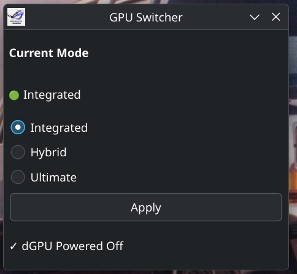

# GPU Switcher

A lightweight Qt6 application for ASUS ROG laptops running Linux.

GPU Switcher provides a simple graphical interface for switching GPU modes using `supergfxctl`, making it easy to switch between Integrated, Hybrid, and other supported GPU modes without using the terminal.

## Features

- 🖥️ Simple Qt6 graphical interface
- ⚡ Switch GPU modes with a single click
- 🔍 Displays the current GPU mode
- 🐧 Built for Linux
- 💻 Designed for ASUS ROG laptops using `supergfxctl`

## Requirements

- Linux
- Qt6
- CMake
- `supergfxctl`

## Building

```bash
git clone https://github.com/4GamingFox/gpu-switcher.git
cd gpu-switcher

mkdir build
cd build

cmake ..
cmake --build .
```

## Running

```bash
./gpu-switcher
```

## Project Status

This project was created for my personal use and is shared as-is.

You're welcome to use, modify, and fork it under the MIT License. While I may make improvements from time to time, I don't guarantee bug fixes, feature requests, or support.

## Screenshot



## License

This project is licensed under the MIT License. See the `LICENSE` file for details.
